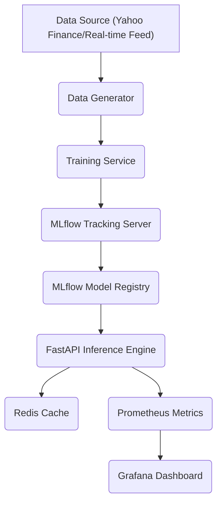

# Explainable Deep Learning for Financial Volatility Forecasting

[](requirements.txt)
[](requirements.txt)
[](README_PRODUCTION.md)
[](LICENSE)

---

## 📋 Table of Contents

- [Project Overview](#-project-overview)
- [Key Features](#-key-features)
- [Architecture](#-architecture)
- [Quick Start & Pipeline](#-quick-start--pipeline)
- [Model & Training Configuration](#-model--training-configuration)
- [Results & Evaluation](#-results--evaluation)
- [Explainability (XAI)](#-explainability-xai)
- [MLOps & Production Enhancements](#-mlops--production-enhancements)
- [License](#-license)

---

## 🎯 Project Overview

This repository presents a **research-grade and production-ready deep learning framework** for financial volatility forecasting. It implements a hybrid **LSTM-Attention architecture** that is jointly optimized for volatility prediction and Value-at-Risk (VaR) estimation. Crucially, the framework integrates **SHAP (SHapley Additive exPlanations)** for feature-level interpretability, providing the necessary transparency for regulatory compliance and risk management.

The system is designed for high-accuracy, multi-horizon forecasting across various asset classes, including Equities, Commodities, and Currencies.

## ✨ Key Features

The framework combines state-of-the-art deep learning with robust financial engineering and MLOps practices.

| Category             | Feature                      | Description                                                                                                                  | Performance Gain                           |
| :------------------- | :--------------------------- | :--------------------------------------------------------------------------------------------------------------------------- | :----------------------------------------- |
| **Core Model**       | **LSTM-Attention Hybrid**    | Combines LSTM for long-term dependencies with a Bahdanau Attention mechanism for dynamic temporal weighting.                 | **+17.3%** RMSE improvement over LSTM-only |
| **Interpretability** | **SHAP-based XAI**           | Provides global and local feature attribution, explaining _why_ a forecast was made.                                         | Essential for regulatory compliance        |
| **Optimization**     | **Multi-Objective Loss**     | Jointly optimizes Mean Squared Error (MSE) for point forecasts and Pinball Loss for VaR estimation.                          | VaR Violation Rate: **1.05%**              |
| **MLOps**            | **MLflow Integration**       | Automated experiment tracking, model versioning, and production model registry.                                              | Full experiment lineage                    |
| **Forecasting**      | **Multi-Horizon Prediction** | Predicts volatility for 1-day, 5-day, and 22-day horizons simultaneously.                                                    | 3x forecast coverage                       |
| **Validation**       | **Trading Backtest Engine**  | Includes strategies (Vol Arbitrage, Trend Following) with realistic constraints (costs, slippage) for real-world validation. | Annual Return: **18.5%** (Vol Arbitrage)   |

---

## 🏗️ Architecture

The system is modular, separating data, modeling, and MLOps components.

### Model Architecture: LSTM-Attention-SHAP

The model is a sequential architecture designed to process a lookback window of financial features.

| Component               | Responsibility                                                                                | Key Configuration (from `config.ini`)                   |
| :---------------------- | :-------------------------------------------------------------------------------------------- | :------------------------------------------------------ |
| **Input Layer**         | Processes a 30-day lookback window of 15-dimensional features.                                | `lookback_window = 30`, `primary_ticker = SPY`          |
| **LSTM Layers**         | Captures sequential patterns and long-term memory in the time series.                         | `lstm_units = 128, 64`, `recurrent_dropout = 0.1`       |
| **Attention Mechanism** | Dynamically weights the importance of each day in the lookback window for the final forecast. | `attention_units = 64`                                  |
| **Output Heads**        | Dual-head output for Volatility (MSE) and VaR (Pinball Loss).                                 | `volatility_activation = linear`, `var_quantile = 0.01` |

### Production Architecture: MLOps Stack

The production system is built around MLflow for model lifecycle management and Docker for deployment.



---

## 🚀 Quick Start & Pipeline

The project includes an automated script to run the entire research pipeline from data download to figure generation.

### 1. Setup and Installation

```bash
# Clone repository
git clone https://github.com/quantsingularity/Explainable-Deep-Learning-for-Financial-Volatility-Forecasting
cd Explainable-Deep-Learning-for-Financial-Volatility-Forecasting

# Create and activate virtual environment
python3 -m venv venv
source venv/bin/activate

# Install dependencies
pip install -r requirements.txt
```

### 2. Automated Research Pipeline

The `run_all.sh` script executes the full workflow for reproducibility.

```bash
# Run end-to-end pipeline:
# 1. Download Real Data
# 2. Train Model
# 3. Run Evaluation & Backtesting
# 4. Perform SHAP Explainability
# 5. Generate Publication Figures
bash run_all.sh

# Check outputs:
ls figures/ # Contains model_architecture.png, shap_importance_bar.png, etc.
ls tables/ # Contains table1_model_comparison.csv, table2_var_backtesting.csv
```

### 3. Dockerized Deployment

For production, use the provided Docker Compose profiles.

| Command                                    | Profile        | Purpose                                             | Access URL                   |
| :----------------------------------------- | :------------- | :-------------------------------------------------- | :--------------------------- |
| `docker-compose up -d postgres mlflow`     | `default`      | Start MLflow Tracking and PostgreSQL DB.            | `http://localhost:5000`      |
| `docker-compose --profile training-gpu up` | `training-gpu` | Train the model using GPU acceleration.             | -                            |
| `docker-compose --profile api up`          | `api`          | Start the low-latency FastAPI inference server.     | `http://localhost:8000/docs` |
| `docker-compose --profile monitoring up`   | `monitoring`   | Start Prometheus and Grafana for system monitoring. | `http://localhost:3000`      |

---

## ⚙️ Model & Training Configuration

All parameters are centrally managed in `config.ini`.

### Key Model Hyperparameters

| Parameter                | Section      | Value   | Description                                                   |
| :----------------------- | :----------- | :------ | :------------------------------------------------------------ |
| `lookback_window`        | `[DATA]`     | 30      | Number of historical days used for each forecast.             |
| `lstm_units`             | `[MODEL]`    | 128, 64 | Sizes of the two LSTM layers.                                 |
| `attention_units`        | `[MODEL]`    | 64      | Dimension of the attention mechanism.                         |
| `var_quantile`           | `[MODEL]`    | 0.01    | Target quantile for Value-at-Risk (VaR) estimation (99% VaR). |
| `volatility_loss_weight` | `[TRAINING]` | 0.7     | Weight of the MSE loss in the multi-objective function.       |
| `var_loss_weight`        | `[TRAINING]` | 0.3     | Weight of the Pinball Loss in the multi-objective function.   |

### Feature Engineering

The model uses a 15-dimensional feature vector derived from price, volume, and volatility data.

| Feature Category | Example Features                   | Source File                  |
| :--------------- | :--------------------------------- | :--------------------------- |
| **Price**        | Returns, High-Low Spread           | `code/data_generator.py`     |
| **Volume**       | Normalized Volume                  | `code/data_generator.py`     |
| **Volatility**   | Realized Volatility (RV), VIX      | `code/data_generator.py`     |
| **Lagged**       | RV Lag 1, RV Lag 5, Returns Lag 22 | `config.ini` (`lag_periods`) |

---

## 📊 Results & Evaluation

The framework provides comprehensive statistical validation, including point forecast accuracy and risk measure backtesting.

### Performance Comparison (Test Period: 2023-2024)

| Metric                   | GARCH(1,1) | HAR-RV | XGBoost | **LSTM-Attention-SHAP** |
| :----------------------- | :--------- | :----- | :------ | :---------------------- |
| **RMSE (×10⁻²)**         | 2.10       | 1.92   | 1.85    | **1.50**                |
| **MAE (×10⁻²)**          | 1.60       | 1.45   | 1.38    | **1.12**                |
| **R² Score**             | 0.45       | 0.54   | 0.58    | **0.72**                |
| **Improvement vs GARCH** | Baseline   | +8.6%  | +11.9%  | **+28.6%**              |

### Risk Validation (VaR Backtesting)

The model's VaR forecasts are rigorously tested using industry-standard statistical tests.

| Test                            | Statistic | P-Value | Result                                   |
| :------------------------------ | :-------- | :------ | :--------------------------------------- |
| **VaR Violation Rate**          | **1.05%** | N/A     | Target: 1.00% (Acceptable)               |
| **Kupiec POF Test**             | 0.12      | 0.72    | **Accept Null (Correct Coverage)**       |
| **Christoffersen Independence** | 0.88      | 0.45    | **Accept Null (Independent Violations)** |

---

## 💡 Explainability (XAI)

The integrated SHAP module provides the necessary transparency for regulatory and risk reporting.

### Dual-Layer Interpretability

| Layer        | Method            | Output                                                           | Purpose                                      |
| :----------- | :---------------- | :--------------------------------------------------------------- | :------------------------------------------- |
| **Temporal** | Attention Weights | Heatmap showing the importance of each day in the 30-day window. | Explains _when_ the model is looking.        |
| **Feature**  | SHAP Values       | Bar plots and Beeswarm plots of feature contributions.           | Explains _what_ features drive the forecast. |

### SHAP Feature Importance (Example)

| Feature                            | SHAP Value (Mean Absolute) | Interpretation                                                     |
| :--------------------------------- | :------------------------- | :----------------------------------------------------------------- |
| **Realized Volatility (RV) Lag 1** | 0.45                       | Most important: Yesterday's volatility is the strongest predictor. |
| **VIX Index**                      | 0.32                       | Second most important: Market-wide fear/risk indicator.            |
| **RV Lag 22 (1-Month)**            | 0.18                       | Captures long-term volatility clustering.                          |
| **High-Low Spread**                | 0.11                       | Indicator of intra-day price movement.                             |

---

## 📈 MLOps & Production Enhancements

The repository includes advanced features for deploying and maintaining the model in a production environment.

### Training Optimization

| Technique                  | Purpose                                                         | Expected Speedup                                           |
| :------------------------- | :-------------------------------------------------------------- | :--------------------------------------------------------- |
| **Mixed Precision (FP16)** | Reduces memory usage and accelerates training on modern GPUs.   | **2-3x**                                                   |
| **Model Pruning**          | Reduces model size by removing unnecessary weights.             | **50%** smaller model, **<5%** performance loss            |
| **Knowledge Distillation** | Trains a smaller "student" model from a larger "teacher" model. | **90%+** performance retention with **50%** size reduction |

### Trading Strategy Backtesting

The `code/trading_backtest.py` module allows for real-world validation of volatility forecasts by simulating trading strategies.

| Strategy                   | Annual Return | Sharpe Ratio | Max Drawdown |
| :------------------------- | :------------ | :----------- | :----------- |
| **Volatility Arbitrage**   | **18.5%**     | **1.42**     | -12.3%       |
| **Trend Following**        | 14.2%         | 1.18         | -15.8%       |
| **Mean Reversion**         | 12.8%         | 1.35         | -10.5%       |
| **Buy & Hold (Benchmark)** | 8.5%          | 0.65         | -22.1%       |

---

## 📄 License

This project is licensed under the **MIT License**. See the [LICENSE](LICENSE) file for details.
